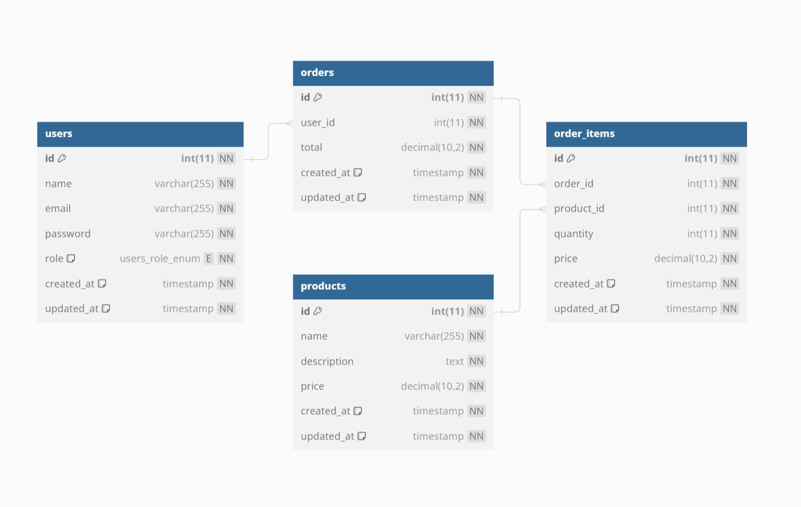

# e-commerce

Shop application with Express.js | Node.js

## 1. Introduction

This application is a simple e-commerce website built with an Express API connected to a MySQL Server.

### A. SQL database

The database contains these following tables: - `users` : a collections of users - `products` : a collections of products - `orders` : a collections of orders - `orders_items` : a binding table of orders and products

Below the UML representation of the database :



### B. Connection to the SQL database

To connect to the SQL database, you need to config your .env file.
It ensures security and integrety of your SQL Server's information.

```javascript
MYSQL_HOST = "host-example";
MYSQL_PORT = "port-example";
MYSQL_USER = "user-example";
MYSQL_PASSWORD = "password-example";
DB_NAME = "db-name-example";
```

> Please make sure that your `.env` is located in `backend/config/` directory
